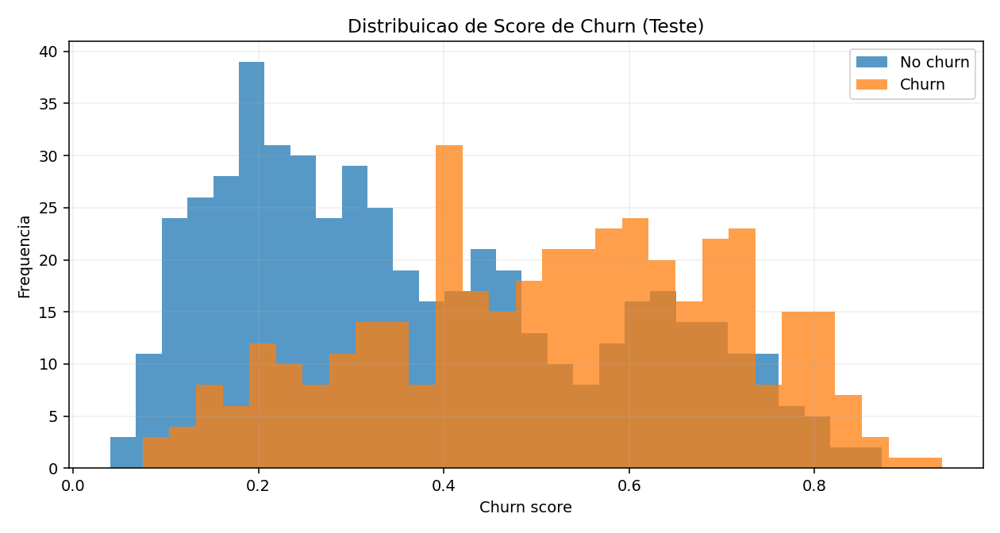
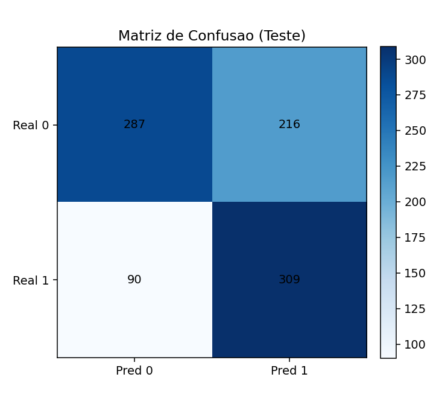
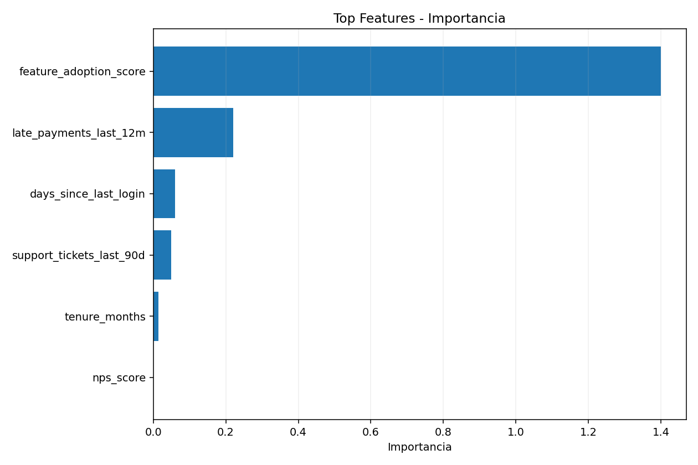

# churn-saas-b2b

Projeto de portfolio para predicao de churn em SaaS B2B com pipeline completo e reproduzivel.

## O que o projeto faz
- Gera dataset estruturado de contas B2B para modelagem de churn.
- Treina e compara baselines (`logistic_regression`, `rule_based`) e usa `xgboost` quando disponivel.
- Realiza tuning com Optuna quando disponivel.
- Ajusta threshold por F1 em validacao.
- Avalia ROC-AUC, accuracy, precision, recall e F1.
- Salva base, score de teste, modelo, metricas e relatorios visuais.

## Estrutura de saida
- `data/churn_saas_synthetic.csv`
- `data/churn_test_scored.csv`
- `models/churn_model.json`
- `models/metrics.json`
- `notebooks/analysis_notes.md`
- `reports/*.png` (quando `matplotlib` estiver instalado)

## Resultados atuais
- ROC-AUC teste: **0.7040**
- F1 teste: **0.6688**
- Threshold selecionado: **0.37**
- Modelo selecionado: **rule_based** (neste ambiente)

## Instalacao minima
```bash
python3 -m venv .venv
source .venv/bin/activate  # Windows: .venv\Scripts\activate
pip install -r requirements.txt
```

## Dependencias recomendadas (stack avancada)
```bash
pip install matplotlib xgboost optuna
```

## Visualizacao
Com `matplotlib` instalado, o pipeline gera automaticamente:
- `reports/score_distribution.png`
- `reports/confusion_matrix.png`
- `reports/feature_importance.png`

### Preview dos graficos




## Como reproduzir
```bash
python3 -m pip install -r requirements.txt
python3 -m pip install matplotlib xgboost optuna
python3 src/main.py
```

## Execucao em lote (raiz do repositorio)
```bash
make run-all
```
