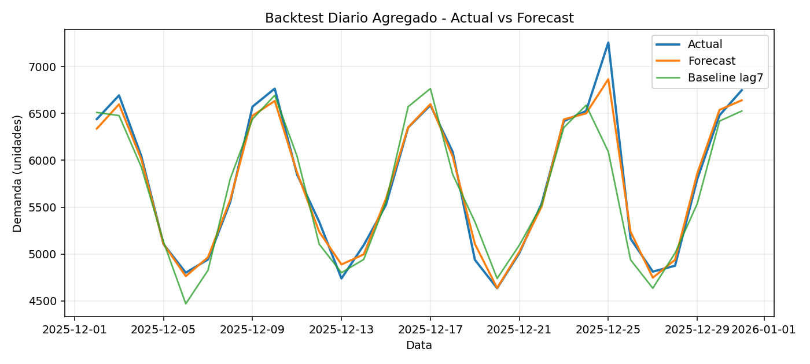
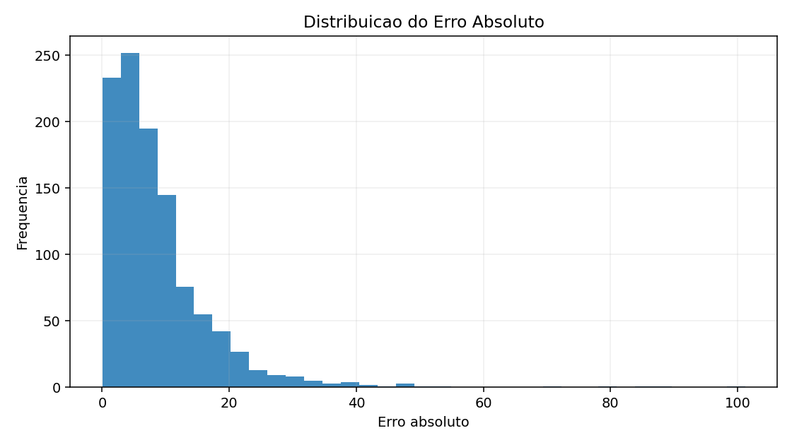
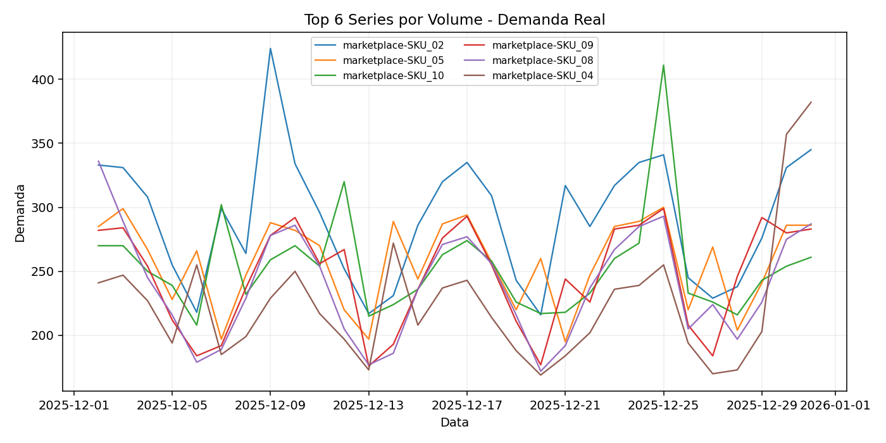

# forecast-demanda-omnichannel

Projeto de portfolio para previsao de demanda por canal e SKU em contexto omnichannel.

## O que o projeto faz
- Gera 4 anos de historico diario por serie (canal + SKU).
- Inclui variaveis de calendario (feriados, dia da semana, semana do ano) e clima (temperatura e chuva).
- Treina modelo supervisionado para demanda com tuning via Optuna quando disponivel.
- Usa XGBoost quando disponivel; se nao estiver instalado, usa fallback robusto com regressao ridge em NumPy.
- Compara desempenho com baseline `lag_7` e salva metricas.
- Inclui DAG de exemplo para orquestracao semanal em Airflow.

## Entregas geradas na execucao
- `data/demand_history_synthetic.csv`
- `data/forecast_backtest.csv`
- `models/model_info.json`
- `models/metrics.json`
- `notebooks/analysis_notes.md`
- `reports/*.png` (quando `matplotlib` estiver instalado)

## Resultados atuais
- MAPE teste (modelo): **5.9667%**
- MAPE teste (baseline lag7): **9.0547%**
- MAE teste (modelo): **8.8187**
- RMSE teste (modelo): **12.7485**
- Backend atual no ambiente local: `ridge_numpy`

## Instalacao minima
```bash
python3 -m venv .venv
source .venv/bin/activate  # Windows: .venv\Scripts\activate
pip install -r requirements.txt
```

## Dependencias recomendadas (stack avancada)
```bash
pip install xgboost optuna
```

## Visualizacao
Com `matplotlib` instalado, o pipeline gera automaticamente:
- `reports/daily_actual_vs_forecast.png`
- `reports/abs_error_distribution.png`
- `reports/top_series_actual_demand.png`

### Preview dos graficos




## Como reproduzir
```bash
python3 -m pip install -r requirements.txt
python3 -m pip install matplotlib xgboost optuna
python3 src/main.py
```

## Execucao
```bash
python3 src/main.py
```

## Orquestracao semanal (Airflow)
- DAG exemplo: `airflow/dags/forecast_omnichannel_dag.py`
- Agenda configurada: toda segunda-feira as 07:00.

## Execucao em lote (raiz do repositorio)
```bash
make run-all
```
